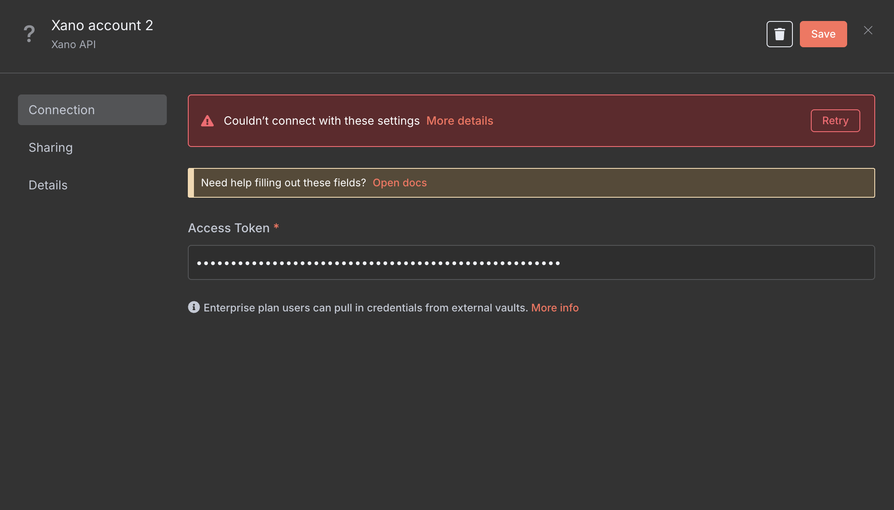

## 🔐 Authentication – Connecting Your Xano Account

To use this node in your workflows, you’ll need to authenticate your Xano account using the **Metadata API Access Token**.

---

### 🔑 Step 1: Get Your Xano Metadata API Access Token

1. **Log in to your Xano account**
   Visit: [https://xano.com](https://xano.com)

2. **Access your instance**
   In the lower-left corner of the dashboard, click **Instances**.

3. **Open instance settings**
   Click the ⚙️ icon next to your instance name.

4. **Select Metadata API**
   From the panel that opens, select **Metadata API**.

5. **Generate an Access Token**
   Click on **➕ Create Token** and configure the following:
   - **Name**: Something descriptive like `n8n integration token`
   - **Expiry**: Set an expiry (e.g. 7 days, or "Never" if preferred)
   - **Scopes**: Select the necessary access:
     - ✅ `Database` (CRUD)

     - ✅ `Content`, `API Groups`, or other required scopes for your use case

   > ⚠️ Make sure to select `Read` and `Update` at a minimum for basic operations.

6. **Copy the generated access token**
   This token will be shown only once. Store it securely.

---

### 🔌 Step 2: Add Credentials in n8n

1. Open your n8n instance
2. Go to **Credentials** and click **"New"**
3. Search for **Xano API** (your node’s credential type)
4. In the **Access Token** field, paste the token from Xano

#### ✅ Successful connection will show:

#### ❌ If token is invalid or expired:

> If the token is invalid, regenerate one from Xano and repeat the above steps.

---

### ✅ Final Step

Once the connection is verified, you’re ready to start using Xano in your workflows via this custom node!

---
