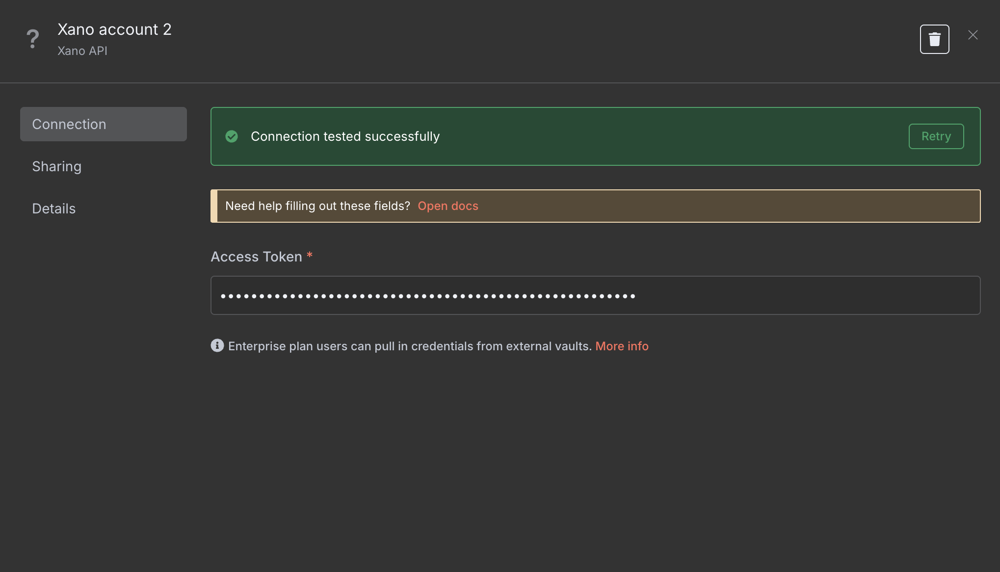
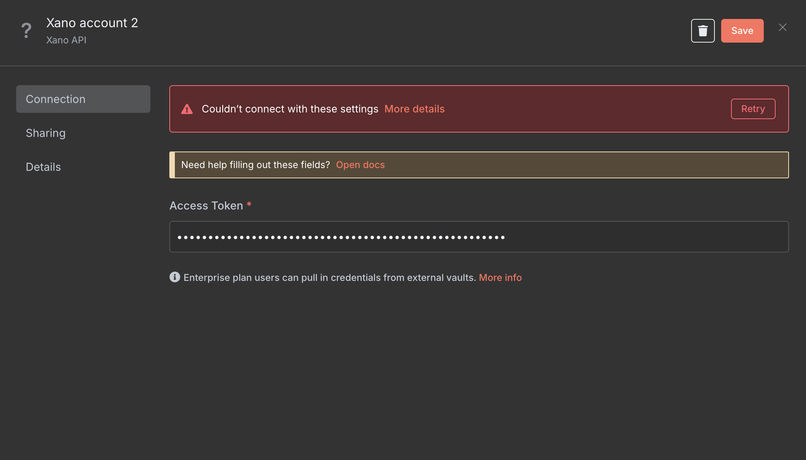

# 📘 n8n-nodes-xano — Custom Node Documentation

This is an n8n community node. It lets you use [Xano](https://www.xano.com/) in your n8n workflows, enabling workflow automation through custom API actions like managing rows, fetching table schemas, and more.

[n8n](https://n8n.io/) is a [fair-code licensed](https://docs.n8n.io/reference/license/) workflow automation platform.

[Installation](#installation)  
[Operations](#-operations)  
[Credentials](#credentials)  <!-- delete if no auth needed -->  
[Compatibility](#compatibility)  
[Usage](#usage)  <!-- delete if not using this section -->  
[Resources](#resources)  
[Version history](#version-history)  <!-- delete if not using this section -->  

---

## Installation

Follow the [installation guide](https://docs.n8n.io/integrations/community-nodes/installation/) in the n8n community nodes documentation.

## 🔧 Operations

| Action                   | Value (operation)     | Description                              |
| ------------------------ | --------------------- | ---------------------------------------- |
| ✅ Create Row            | `createRow`           | Create a new row in a selected table     |
| ✅ Update Row            | `updateRow`           | Update a row with specific field values  |
| ✅ Delete Single Content | `deleteSingleContent` | Delete a single row by ID                |
| ✅ Get a Row             | `getSingleContent`    | Fetch a row by ID                        |
| ✅ Get Many Rows         | `getTableContent`     | Fetch multiple rows with pagination      |
| ✅ Create Bulk Rows      | `bulkCreateContent`   | Insert multiple rows                     |
| ✅ Update Bulk Rows      | `bulkUpdateContent`   | Bulk update multiple records             |
| ✅ Search Rows           | `searchRow`           | Search using filter queries (JSON input) |

## Credentials

To use this node in your workflows, you’ll need to authenticate your Xano account using the **Metadata API Access Token**.

### 🔑 Step 1: Get Your Xano Metadata API Access Token

1. **Log in to your Xano account**
   Visit: [https://xano.com](https://xano.com)

2. **Access your instance**
   In the lower-left corner of the dashboard, click **Instances**.

3. **Open instance settings**
   Click the ⚙️ icon next to your instance name.

4. **Select Metadata API**
   From the panel that opens, select **Metadata API**.

5. **Generate an Access Token**
   Click on **➕ Create Token** and configure the following:
   - **Name**: Something descriptive like `n8n integration token`
   - **Expiry**: Set an expiry (e.g. 7 days, or "Never" if preferred)
   - **Scopes**: Select the necessary access:
     - ✅ `Database` (CRUD)

     - ✅ `Content`, `API Groups`, or other required scopes for your use case

   > ⚠️ Make sure to select `Read` and `Update` at a minimum for basic operations.

6. **Copy the generated access token**
   This token will be shown only once. Store it securely.

### 🔌 Step 2: Add Credentials in n8n

1. Open your n8n instance
2. Go to **Credentials** and click **"New"**
3. Search for **Xano API** (your node’s credential type)
4. In the **Access Token** field, paste the token from Xano

#### ✅ Successful connection will show:



#### ❌ If token is invalid or expired:



> If the token is invalid, regenerate one from Xano and repeat the above steps.

### ✅ Final Step

Once the connection is verified, you’re ready to start using Xano in your workflows via this custom node!

## Compatibility

Tested on n8n v1.100.0 and above.

## Usage

Note about the **Search Rows** operation. It uses a simplified version of the [external filtering search](https://docs.xano.com/xano-features/metadata-api/search#search) syntax. 

Here's a quick example where I'm searching for the record where id = 2.

```[{"id|=":"2"}]```

Simply add the JSON above to the Search field.

**Pro tip**: Open Dev Tools in your browser then use the Xano UI filter in your table view to see what syntax gets generated by the /content API request, then copy the value from the search field in the payload and use that.

## Resources

* [n8n community nodes documentation](https://docs.n8n.io/integrations/#community-nodes)
* [Xano Documentation](https://docs.xano.com/)

## Version history
###0.1.0
Initial release
